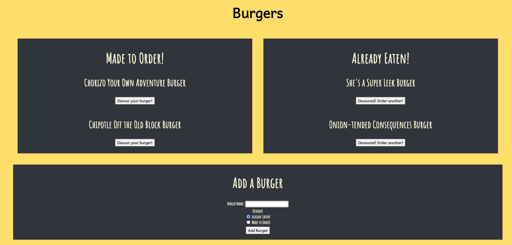

# BURGER APP WITH NODE EXPRESS HANDLEBARS

# Note Taker

## Table of Contents:
*[Description](#description)  
*[Images](#images)  
*[Installation](#installation)  
*[Usage](#usage)  
*[License](#license)  
*[Contribute](#contribute)  
*[Tests](#tests)  
*[Questions](#questions)  

## DESCRIPTION:

Create a burger logger with MySQL, Node, Express, Handlebars and a homemade ORM. Be sure to follow the MVC design pattern; use Node and MySQL to query and route data in your app, and Handlebars to generate your HTML.

## IMAGES:

## INSTALLATION

node express js

node express handlebars

mysql

heroku (deployed site)

## USAGE

Categorizing items based on true/false, specifically burgers made and burgers eaten.

## LICENSE

N/A

## CONTRIBUTE

used UNCC Bootcamp Cat App as reference

## TESTS

N/A

## QUESTIONS

GitHub: lindsaymorris813

Email: lindsaymorris813@gmail.com
